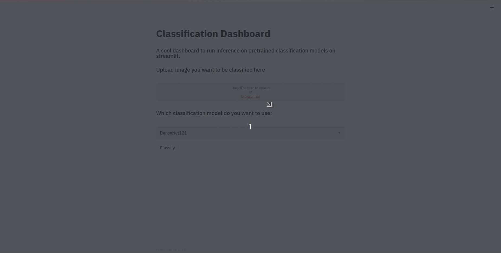

# classification-dashboard
 A cool dashboard built to run inference on pretrained classifiers with streamlit. <br />
## Motivation
 As a beginner to CNN architecture you might have difficulty in deciding the most appropriate and accurate architecture and this dashboard provides an ideal platform to do so.<br />
## Requirements
 Python 3.8 or above with all [requirements](requirements.txt) dependencies installed. To install run:
```python
$ pip install -r requirements.txt
```
## To Run
```python
$ streamlit run dashboard.py
```
## Available architectures
* DenseNet121
* DenseNet161
* GoogLeNet
* InceptionV3
* ResNet34
* ResNet50<br>
## Tutorial
#### Upload a picture, select an architecture and push "Classify"

## Note
#### Weights for all of the architectures are downloaded and may take from 30 to 100 mb per model. <br>
## ToDo
- [ ] Add more possible architectures. 
- [ ] Deploy on Herouku
- [ ] Work on UI

By: [Aryan Kargwal](https://github.com/aryankargwal) and [Pranjal Datta](https://github.com/pranjaldatta)
